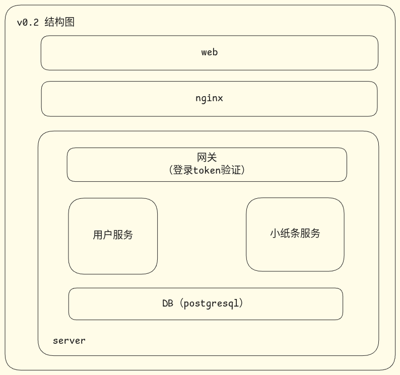

# 未命名计划

微服务架构示例项目，在学习微服务架构的过程中编写，配套有一个web界面。

- 涉及微服务的内容尽量不调用第三方库，而是学会一部分、手搓一部分
- 完成后会部署到公网，如果[公网地址](https://115.190.167.134)不可用，多半是我买的云服务器到期了 ^_^ （2026.9.25）

## 效果图

todo：截几张使用截图，包括pc端和移动端（等移动端ui调整之后）

## 使用

使用本项目需要以下环境：（版本号为经过测试的推荐版本）

- go 1.25
- node 24 (corepack-pnpm)
- postgresql 16

本地运行：`server/.run/`文件夹包含服务端程序构建配置（jetbrains ide可用），修改配置文件即可启动服务端程序。

云端部署：执行`scripts/build.sh`，会在项目根目录下生成`build`文件夹，将该文件夹上传到云服务器，执行其中的shell脚本即可启动服务端程序。

## 设计图

> 感谢：[绘图工具](https://excalidraw.com)，[压缩工具](https://tinypng.com)

## 项目介绍

目录：

- build：生成的部署用内容
- doc：文档
    - deploy：部署文档，介绍把程序发布到公网的主要步骤（含nginx反向代理配置）
- scripts：脚本
    - build.sh：在本地使用，生成可以部署到云服务器的内容（包括几个服务端程序及启动脚本、web页面）
    - restart_server.sh：在云服务器使用，启动所有服务端程序
- server：服务端代码
- web：ui代码

主要技术、框架与工具：

- go 1.25
- gorm
    - ORM: Object Relation Mapping，对象关系映射，将数据库的行、列甚至数据库本身，映射成编程语言的对象或字段。
      使用ORM，可以通过形如`db.create(user)`的方式操作数据库，而不需要编写形如`insert into user values (...)`的sql
    - DAO: Data Access Object，数据访问对象，将数据库操作包装在一起，与业务代码分离。
      主要应用场景有：需要接多个数据库（pg、mysql、sqlite）、数据操作复杂（例如复杂查询，sql写出来上KB的）
- gocts：自研工具，可以根据go定义的接口结构，生成对应ts的结构class和axios client代码。

- vue3 (html+ts+less)
- node 24 (corepack-pnpm)
- vite
- axios
- vue-router
- pinia
- element-plus
- eslint+prettier

- nginx
- postgresql
- shell

一个http请求的处理过程：

- 一个请求来到网关，验证请求头`Origin`是否是允许的（配置文件），请求方法是不是`post`
    - nginx会配置请求发往网关
    - 验证通过后会设置允许跨域、允许额外的请求头、响应头
    - 直接返回所有非`post`请求
- 根据请求的uri，尝试获取对应的处理器
    - 获取失败，视为不支持的接口请求，返回失败
- 执行处理器中注册的中间件、处理函数
    - 网关服务的处理函数统一为转发，即将收到的请求转发给对应的业务服务
    - 转发会修改`Origin`为网关的监听地址，还会带上自定义的请求头
- 现在请求来到了业务服务，还是验证`Origin`、获取处理器、执行中间件和处理函数的流程
    - 业务服务的处理函数可能还包含转发，流程上就是这一步骤的重复
- 业务服务返回执行结果给转发者，转发者执行完后续流程后返回给前端
    - 转发者可能是网关，也可能是另一个业务服务，参考上一环节

具体的，一个登录请求的处理过程：

- 请求发到网关，网关查表获取转发参数，转发请求
    - 转发参数：主要指转发到哪个端口（转发给哪个业务服务）
- 请求来到用户服务，验证密码、totp码，签发token，返回网关
- 网关返回给前端

一个写小纸条请求的处理过程：

- 请求发到网关，网关验证token，查表获取转发参数，转发请求
- 请求来到小纸条服务，小纸条服务调用用户服务的验证接口
- 请求来到用户服务，返回用户信息
    - 验证token移动到网关后，用户服务的验证接口更像是小登录了
- 小纸条服务返回返回网关
- 网关返回给前端
